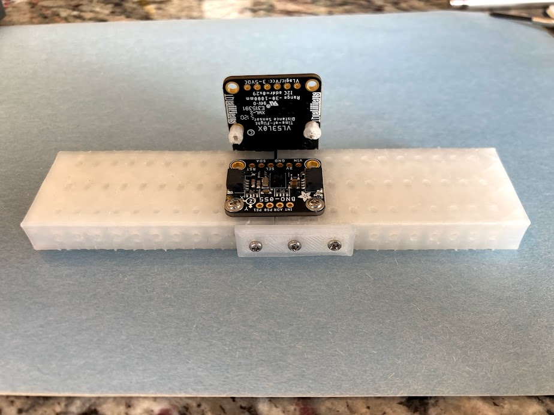
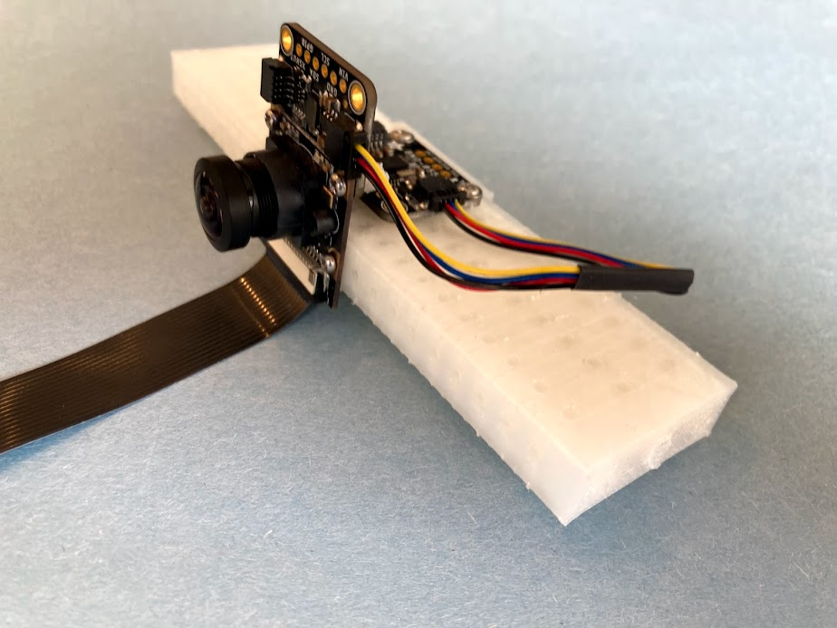
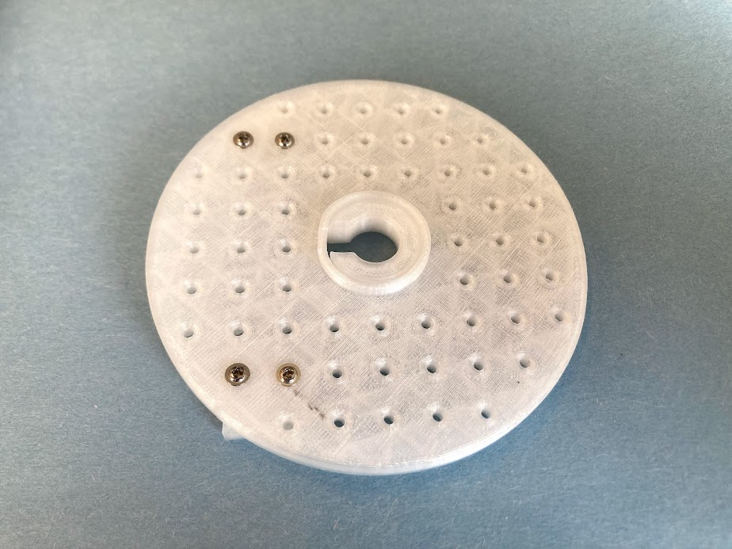
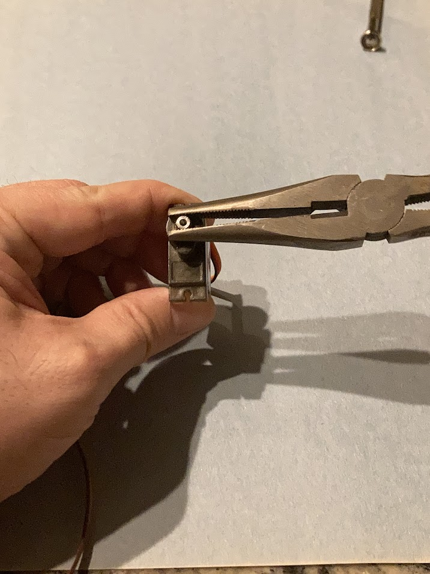
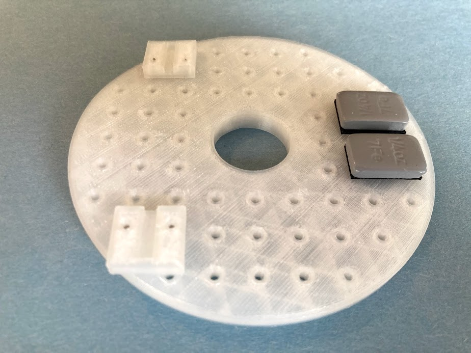
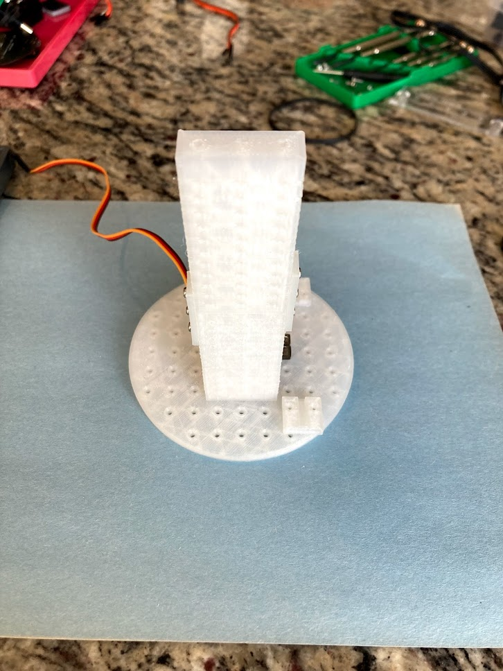
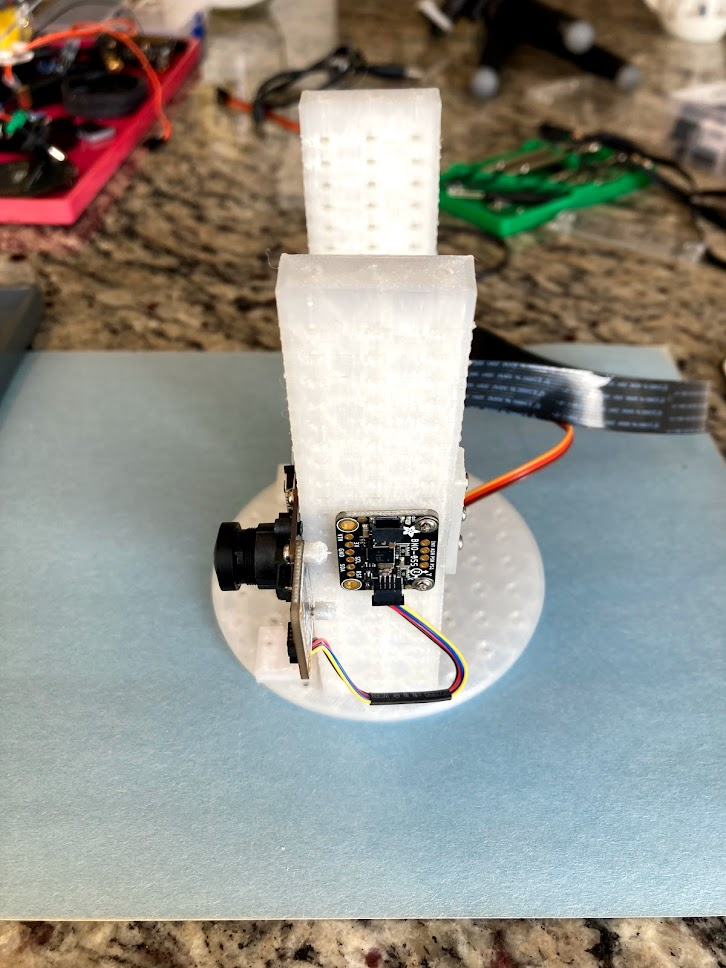
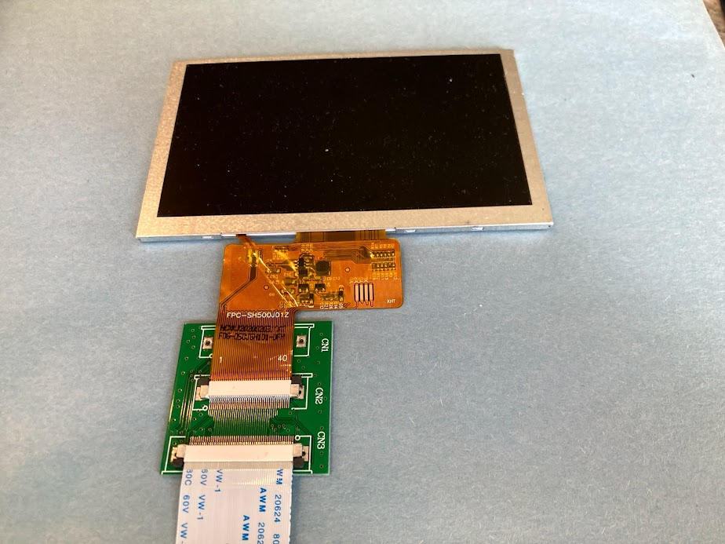
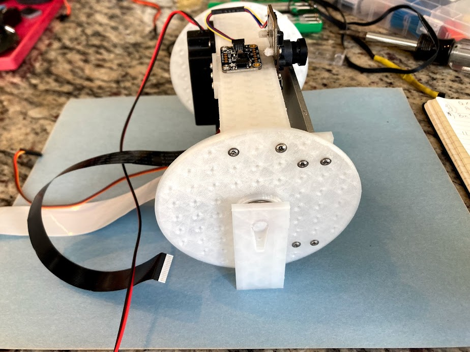

# Ro-Bud - Lovable, Accessible, Autonomous Companion
  

## Table of Contents
 * [Summary](#summary)
 * [Description](#description)
 * [Pre-Alpha Build Instructions](#pre-alpha-build-instructions)
   * [Parts Reference](#parts-reference)
   * [Head Assembly](#head-assembly)
   * [Base Assemply](#base-assembly)
      * [Soldering](#1-soldering)
 * [Original Project Announcement Videos](#original-project-announcement-videos)
   * [Part 1](#part-1)
   * [Part 2](#part-2)
   * [Part 3](#part-3)
   * [Part 4](#part-4)
## Summary
The Ro-Bud project seeks to create a companion bot that is lovable, accessible to all, and autonomous.  

[Return to Table of Contents](#table-of-contents)

## Description
Challenge: Despite decades of fictional depiction through popular culture, as of 2021, robotic companion bots that even come close to those of popular imagination are not available at scale.

While there have been impressive private for-profit attempts at releasing relatively advanced consumer companion bots, specifically Jibo and Anki Vector, these endeavors ultimately proved commercially unviable, forcing the companies to fold, and effectively removing these wonderfully engineered robots from either availability or full operability (as they were dependent on proprietary services provided by their now-defunct companies).

The Ro-Bud project is an attempt to pick up where Jibo and Ankni left off, and fulfil the dream of providing a consumer robot that is:
1. LOVEABLE - Feels just like a family pet
2. ACCESSIBLE - Can be built by anyone following project instructions with readily available parts with a cost at or under $500
3. AUTONOMOUS - Has it's own goals.  

[Return to Table of Contents](#table-of-contents)

# Pre-Alpha Build Instructions
**NOTE: The following build instructions are in-progress and not yet complete**  
Last updated 3-October 2021  

**Documentation To-Do**
 * [ ] Add 3d-printable models
 * [ ] Jetson Wifi Module Install
 * [ ] SD Card Flashing
 * [x] Head Assembly
 * [ ] Base Assembly
    * [x] Soldering
    * [ ] Assembly
    * [ ] Wiring    
 * [ ] Remote VM setup
 * [ ] Remote Operation Instructions

[Return to Table of Contents](#table-of-contents)

## Parts Reference
 * A. horizontal braces (3d-printed)
 * B. 3-hole fastener (3d-printed)
 * C. 2x8mm round-head self-tapping screws https://www.amazon.com/gp/product/B07NT5288W  
 * D. 2x8mm pan-head-with-washer self-tapping screws https://www.amazon.com/gp/product/B07NTGRFBF  
 * E. BNO055 orientation sensor https://www.adafruit.com/product/4646  
 * F. SainSmart IMX219 Camera Module https://www.amazon.com/gp/product/B07VFFRX4C  
 * G. VL53L0X time-of-flight distance sensor https://www.adafruit.com/product/3317  
 * H. 1-hole 2mm screw fastener (3d-printed)
 * I. 300mm 15-pin camera ribbon cable https://www.adafruit.com/product/1648
 * J. 100mm Stemma QT JST SH 4-pin cable https://www.adafruit.com/product/4210
 * K. display fastener (3d-printed)
 * L. servo adapter (3d-printed)
 * M. head barrel wall (3d-printed)
 * N. head shaft adapter (3d-printed)
 * O. bearing https://www.amazon.com/gp/product/B07S1B3MS6  
 * P. balance weights https://www.amazon.com/gp/product/B00ZMD8SDG  
 * Q. MG90S 9G micro servo https://www.amazon.com/gp/product/B07F7VJQL5  
 * R. 7in display https://www.adafruit.com/product/1934  
 * S. 250mm 40pin display ribbon cable https://www.amazon.com/gp/product/B00N426GJA  
 * T. mono enclosed speaker - 3W 4 Ohm https://www.adafruit.com/product/3351  
 * U. head L bracket (3d-printed)
 * V. servo horn (included with servo(Q))
 * W. servo screw (included with servo(Q))
 * AA1. solid-core 22AWG wire - Black https://www.adafruit.com/product/290
 * AA2. solid-core 22AWG wire - Red https://www.adafruit.com/product/288
 * BB. DC "TT" motors (come with chassis kit)
 * CC. SparkFun Qwiic SHIM for Raspberry Pi https://www.sparkfun.com/products/15794
 * DD. Stacking Header for Pi A+/B+/Pi 2/Pi 3 - 2x20 Extra Tall Header https://www.adafruit.com/product/1979
 * EE. Adafruit DC & Stepper Motor Bonnet for Raspberry Pi https://www.adafruit.com/product/4280
 * FF. Break-away 0.1" male header https://www.adafruit.com/product/392
 * GG. Male/Male Jumper Wires - 20 x 6" (150mm) https://www.adafruit.com/product/1957
 * HH. Female/Female Jumper Wires - 20 x 6" (150mm)Female/Female Jumper Wires - 20 x 6" (150mm)
 * II. Heat shrink tubing https://www.adafruit.com/product/1649
 * JJ. 3.5mm (1/8") Stereo Audio Plug Terminal Block https://www.adafruit.com/product/2790
 * KK. Rocker toggle switch (comes with chassis kit)

[Return to Table of Contents](#table-of-contents)
 
## Head Assembly

### 1. Attach two horizontal braces(A) with 3-hole fastener(B) & attach BNO-055  orientation sensor(E)  

**Parts:**  
   * x2 A. horizontal braces  
   * x1 B. 3-hole fastener  
   * x3 C. 2x8mm round-head self-tapping screws  
   * x4 D. 2x8mm pan-head-with-washer self-tapping screws  
   * x1 E. BNO055 orientation sensor  

>_**Notes:**_ 
>   * _Make sure Y axis of BNO055(E) points toward picture as shown in image_
>   * _Only fasten one side of the horizontal braces(E)_
     

---
### 2. Turn 180 degrees and attach camera(F) 

**Parts:**  
   * x1 F. SainSmart IMX219 Camera Module
   * x2 C. 2x8mm round-head self-tapping screws

---    
### 3. Attach VL53L0X time-of-flight distance sensor(G) 

**Parts:** 
  * x2 H. 1-hole 2mm screw fastener  
  * x2 C. 2x8mm round-head self-tapping screws  
  * x1 G. VL53L0X time-of-flight distance sensor  

---     
### 4. Attach camera 15-pin ribbon(I) cable & STEMMA QT cable(J)

**Parts:** 
  * x1 I. 300mm 15-pin camera ribbon cable
  * x1 J. 100mm Stemma QT JST SH 4-pin cable

>_**Notes:**_ 
>   * _Make sure pins of ribbon cable are facing toward contacts and fastened securely_
>   * _Attatch STEMMA QT cable(J) securely to right STEMMA sockets on VL53L0X(G) and BNO055(E)_
   

---   
### 5. Attach display fasteners(K) and servo adapter(L) to left barrel wall(M)
**Parts:**  
 * x1 M. head barrel wall
 * x1 L. servo adapter
 * x2 K. display fastener
 * x4 D. 2x8mm pan-head-with-washer self-tapping screws

>_**Notes:**_
>   * _Make sure fasteners and raised center lip are on opposite sides_
>   * _Make sure slotted sides of the display fasteners(K) are face up, with open sides pointed inside the circle, and closed ends are pointed out_
>   * _Make sure servo adapter is oriented as shown in image_
>   * _If servo adapter cannot be popped in, soften with a hair dryer or heat gun_

---   
### 6. Backdrive servo to 90 degrees
**Parts:**  
   * x1 Q. MG90S 9G micro servo  

>_**Notes:**_
>   * _Suggested steps:_
>     * _Use pliars to gently turn the servo shaft counter-clockwise until you hit the physical stop._
>     * _Then position your pliars at the top at 12:00 as shown in the first picture._
>     * _Finally, carefully turn the shaft clockwise 90 degrees to 3:00 as shown in the second picture._  

---   
### 7. Pop servo(Q) into left barrel wall(M)
**Parts:**  
   * x1 Q. MG90S 9G micro servo  
   * x2 M. left barrel wall(M) from step 5  

>_**Notes:**_
>   * _Body of servo should be on same side as fasteners from step 5_  

---   
### 8. Add shaft(N) to bearing(O)
**Parts:**  
 * x1 N. head shaft adapter 
 * x1 O. bearing 

>_**Notes:**_
>   * _If shaft cannot be popped in, soften with a hair dryer or heat gun_
>   * _The longer side of the shaft should be in the bearing_

---   
### 9. Attach display fasteners(K) and balance weights(L) to right barrel wall(M)
**Parts:**  
 * x1 M. head barrel wall
 * x2 K. display fastener
 * x2 P. balance weights

>_**Notes:**_
>  * _Make sure fasteners and raised center lip are on opposite sides_

---   
### 10. Pop bearing(O) into right barrel wall(M)
**Parts:**  
 * x1 bearing(O) with shaft(N) from step 8
 * x1 right barrel wall(M) from step 9

>_**Notes:**_
>   * _Make sure shaft is on the opposite side of the clips & weights_
>   * _If bearing cannot be popped in, soften with a hair dryer or heat gun_

---   
### 11. Attach two horizontal braces(A) with two 3-hole fasteners(B) to create lower head brace
**Parts:**  
   * x2 A. horizontal braces  
   * x2 B. 3-hole fasteners  

>_**Notes:**_
>  * _Make sure to add 3-hole fastener(B) to both sides_

---   
### 12. Attach bottom head brace to left barrel wall
**Parts:**  
   * x1 Left barrel wall with servo (from step 7)  
   * x1 Lower horizontal head brace (from step 11)  
   * x2 D. 2x8mm pan-head-with-washer self-tapping screws
  

---   
### 13. Attach top head brace to left barrel wall
**Parts:**  
   * x1 Left barrel wall with servo (from step 12)  
   * x1 Top horizontal head brace with camera (from step 1)  
   * x2 D. 2x8mm pan-head-with-washer self-tapping screws
  

---   
### 14. Attach 40-pin display ribbon(S) to display(R)  
**Parts:**  
   * x1 R. 7in display  
   * x1 S. 250mm 40pin display ribbon cable  

>_**Notes:**_
>   * _Make sure pins of ribbon cable are facing toward contacts and fastened securely_

---   
### 15. Pop display(S) into clips of left barrel wall(M)
**Parts:**  
   * x1 R. 7in display  
   * x1 left barrel wall with servo (from step 12)  

>_**Notes:**_
>   * _Make sure the cables are on the bottom (opposite camera) and feed bewtween both horizontal braces_

---   
### 16. Pop right barrel(M) display fasteners(K) onto display and secure to horizontal braces(A) 
**Parts:**  
   * x1 right barrel wall(M) with bearing and shaft (from step 10)
   * x2 D. 2x8mm pan-head-with-washer self-tapping screws

---   
### 17. Attach speaker(T)
**Parts:**  
   * x1 T. mono enclosed speaker - 3W 4 ohm
   * x2 D. 2x8mm pan-head-with-washer self-tapping screws

---   
### 18. Pop right L bracket(U) on bearing shaft
**Parts:**  
   * x1 U. head L bracket

>_**Notes:**_
>   * _If shaft does not pop onto L bracket, use hair dryer or heat gun to soften_

---   
### 19. Attatch servo horn to remaining L bracket(L) and secure with screw(D)
**Parts:**  
   * x1 U. head L bracket
   * x1 V. servo horn
   * x1 D. 2x8mm pan-head-with-washer self-tapping screw

---   
### 20. Secure left L bracket to head with servo screw(W)
**Parts:**  
   * x1 W. server screw

>_**Notes:**_
>  * _IMPORTANT: The servo horn should be pointing straight down attached with screen pointing straight left_
>  * _Be careful not to turn servo shaft when attaching. If you do, repeat step 6._

---   
### 21. The head is now complete and should match the images below:  

[Return to Table of Contents](#table-of-contents)

## Base Assembly

[Return to Table of Contents](#table-of-contents)

### 1. Soldering  
>_**Notes:**_ 
>   * _I tried to keep soldering to a minumum, but there are some items that need to be soldered._

#### 1.A. Solder 40 cm of red(AA1) & black(AA2) solid-core wire to DC motors(BB) as shown below.

**Parts:**  
   * x2 AA1. solid-core 22AWG wire - Black (40cm)
   * x2 AA2. solid-core 22AWG wire - Red (40cm)
   * x2 BB. DC "TT" motors
 
>_**Notes:**_ 
>   * _It is helpful to lable the left & right motors(BB)_
>   * _Be sure to keep wires(AA) on outside of motors(BB)_
>   * _Red wire(AA) on top on left motor(BB)_
>   * _Black wire(AA) on top on right motor(BB)_

     

---
#### 1.B. Solder SparkFun Qwiic SHIM(BB) to 2x20 Extra Tall Header(CC) as shown below.

**Parts:**  
   * x1 CC. SparkFun Qwiic SHIM for Raspberry Pi
   * x1 DD. Stacking Header for Pi A+/B+/Pi 2/Pi 3 - 2x20 Extra Tall Header 
 
>_**Notes:**_ 
>   * _The Qwicc SHIM is designed to NOT have to be soldered, but I've found that it is necessary to keep good i2c connection as Ro-Bud moves around._
   

---
#### 1.D. Solder male header(FF) to 4 extra PWM pins on Stepper Motor Bonnet(EE)

**Parts:**  
   * x1 EE. Adafruit DC & Stepper Motor Bonnet for Raspberry Pi
   * x1 FF. Break-away 0.1" male header (4 pins)
 
>_**Notes:**_ 
>   * _These extra PWM pins allow us to use the PCA9685-based motor bonnet to drive Ro-Bud's head servo in addition to the motors_
>   * _I forgot to take a photo of the soldering step but the second image below shows me connecting the servo to the 4 soldered pins at the bottom of the motor bonnet_

---
#### 1.E. Splice orange male jumper wire(GG) to red male jumper wire(GG) and plug in red/orange/brown wires(GG) into 3.5mm audio plug terminal block(JJ)

**Parts:**  
   * x1 GG. Male/Male Jumper Wires - 20 x 6" (150mm) (red)
   * x1 GG. Male/Male Jumper Wires - 20 x 6" (150mm) (orange)
   * x1 GG. Male/Male Jumper Wires - 20 x 6" (150mm) (brown) 
   * II. Heat shrink tubing (as needed) 
   * x1 JJ. JJ. 3.5mm (1/8") Stereo Audio Plug Terminal Block

>_**Notes:**_ 
>   * _After splicing connect to audio plug as follows:_
>      * _orange to L_
>      * _red to R_
>      * _brown to Ground_
>   * _This allows us to merge the left & right audio channels from the ReSepaker board to send to the speaker. With both channels it's enough to drive the speaker without an additional amp!_
 

---
#### 1.F. Solder 2 black 40cm solid-core wires to each side of toggle switch  

**Parts:**  
   * x4 AA1. solid-core 22AWG wire - Black (40cm)
   * x1 KK. Rocker toggle switch 
   * II. Heat shrink tubing (as needed) 

>_**Notes:**_ 
>   * _This switch will break the cirucuit of the shared ground of Ro-bud to allow both power supplies to be switched on-and-off together._
>   * _**IMPORTANT:** Be sure to make sure that there is no short between the two sides of the switch (otherwise, Ro-Bud won't be able turn off)_
 

[Return to Table of Contents](#table-of-contents)  

---
## Original Project Announcement Videos  
These videos are the original annoucement and project plan for Ro-Bud uploaded to TikTok on 17-April 2021.  

[Return to Table of Contents](#table-of-contents)
### Part 1  
  

[Return to Table of Contents](#table-of-contents)
### Part 2
  

[Return to Table of Contents](#table-of-contents)
### Part 3
  

[Return to Table of Contents](#table-of-contents)
### Part 4
  

[Return to Table of Contents](#table-of-contents)

